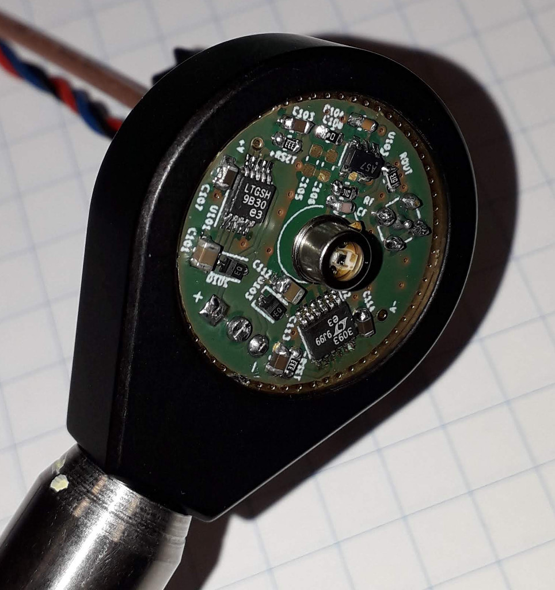

# One-Inch-Photodetector
Photodiode transimpedance amplifier, on a one inch diameter (25 mm) circular 2-sided PCB - for mounting in a
standard 1" lens-mount.

[TIASim](https://github.com/aewallin/TIASim) can be used to predict gain, noise, and bandwidth using different op-amps, 
transimpedance-gains, etc. Initial results show that capacitive loading on the MMCX connector, when 
connecting a coaxial cable to Spectrum Analyzer or Oscilloscope, plays a role. For un-buffered op-amps TIASim predictions agree 
with measurements when op-amp GBWP is 'de-rated' slightly - probably due to the capacitive load on the output. 
Latest PCB versions use a buffer/cable-driver [BUF602](https://www.ti.com/product/BUF602) to isolate the sensitive transimpedance amplifier 
from output loading.

The board features low-noise LDOs [LT3042](https://www.analog.com/media/en/technical-documentation/data-sheets/3042fb.pdf) 
and [LT3093](https://www.analog.com/media/en/technical-documentation/data-sheets/lt3093.pdf) to produce +V and -V 
DC-rails for the op-amp. The photodiode footprint is TO-18, to fit e.g. Hamamatsu Si photodiodes 
[S5973, S5972, S5973](https://www.hamamatsu.com/resources/pdf/ssd/s5971_etc_kpin1025e.pdf), or Thorlabs 
Si detectors FDS015, FDS025, FD11A, or Thorlabs InGaAs detectors such as FGA01, FGA01FC, FGA015, FDGA05, FD05D, FD10D.

Thorlabs photodiodes seem to match OSI part numbers:
* Thorlabs FGA01FC, marked INGAAS-120L-FC
* Thorlabs FDS015, marked FCI-125G-006HR
* Thorlabs FDS025, marked FCI-125G-010HRL

The output is DC-coupled to a MMCX connector, to fit the small board.

Examples of completed and teseted boards:
* (OPA818-board, BUF602 output buffer) [OPA818 op-amp, FGA01FC photodiode, 4.7 kOhm RF](http://www.anderswallin.net/2021/04/200mhz-photodetector-with-opa818-fga01fc-ingaas-photodiode-and-rf4k7/), >200 MHz -3dB bandwidth.
* (OPA818-board, BUF602 output buffer) [OPA818 op-amp, FDS015 or FDS025 photodiode, 1.2 kOhm RF](http://www.anderswallin.net/2020/11/400-mhz-photodetector-with-opa818/), >400 MHz -3dB bandwidth.
* (SOT23-board, unbuffered) [OPA657 op-amp, S5973 photodiode, 10 kOhm RF](http://www.anderswallin.net/2020/01/one-inch-photodetector-v1/), around 59 MHz -3 dB bandwidth. With measured [signal and noise spectra](http://www.anderswallin.net/2020/01/photodetector-signal-and-noise/)
* (SOT23-board, unbuffered) [OPA657, S5971 photodiode, 1 MOhm transimpedace](http://www.anderswallin.net/2020/05/1-mohm-4-mhz-photodetector/), 4 MHz bandwidth

(May 2020) SOT23 detector mounted in 1" lens-mount. DC-inputs (+,GND,-) at the bottom. LDOs left and right of the DC-inputs. Photodiode center. Op-amp at the top with MMCX output-connector on the backside of the board, top right.

## OPA818 with BUF602 output-buffer

This is the best performing board so far, in terms of bandwidth!

## HMC799 with BUF602 output-buffer
NOTE: the prototype-board has not worked correctly so far. shows self-oscillations. build at your own risk!

[HMC799](https://www.analog.com/media/en/technical-documentation/data-sheets/hmc799.pdf) is a 10 kOhm transimpedance amplifier with up to 700 MHz bandwidth.

This design also uses a [BUF602](https://www.ti.com/lit/ds/symlink/buf602.pdf) output buffer, to hopefully avoid capacitive loading of the transimpedance amplifier as coaxial cables are connected to the output.

## SOT23, unbuffered
This version of the detector is for a SOT23 op-amp such as [OPA657(FET 1.6GHz)](http://www.ti.com/lit/ds/sbos197f/sbos197f.pdf), [OPA847(bipolar 3.9GHz)](http://www.ti.com/lit/ds/symlink/opa847.pdf), and similar.

## WSON8, unbuffered
This version is for modern op-amps in WSON8 footprint such as [OPA855(bipolar 8GHz)](http://www.ti.com/lit/ds/symlink/opa855.pdf), [OPA858(FET 5.5GHz)](https://www.ti.com/lit/ds/symlink/opa858.pdf), [OPA859(FET 1.9GHz)](http://www.ti.com/lit/ds/symlink/opa859.pdf)

